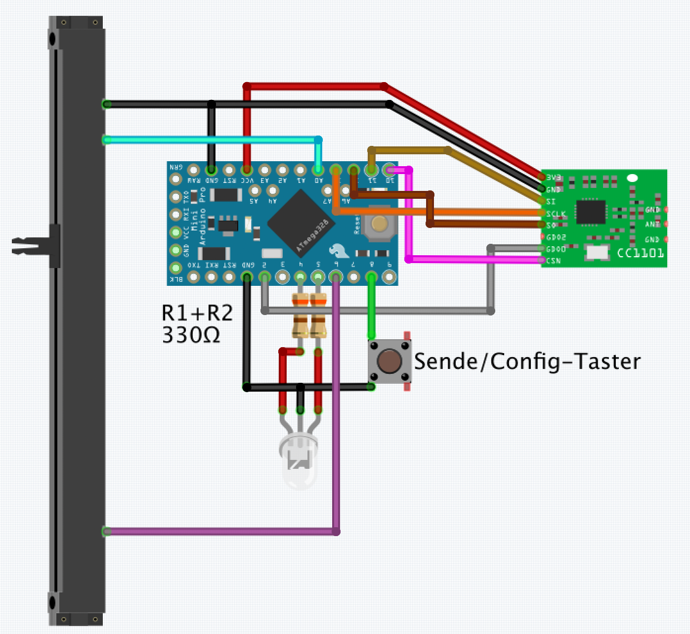
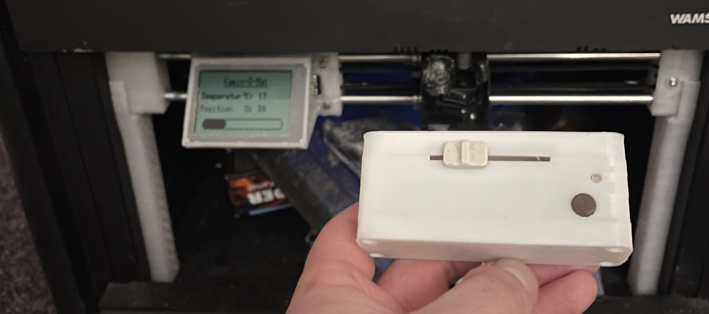

# HB-RC-X-POS

#### Homebrew Mehrkanalsender für Homematic.

Da es in der Homematic-Welt keine (mir bekannte) Möglichkeit gibt, einen Absolutwert mittels Direktverknüpung zu senden, habe ich den Umweg über mehrere Direktverknüpfungen gewählt.
  
Es soll erreicht werden, gezielt Dimmerwerte zu setzen.
  
Der Sketch - so wie er ist - zerteilt die Skala eines Schiebe-Potis in 10 gleiche Teile.
Jeder 10te Teil stellt einen Taster-Kanal (nur SHORT PRESS) dar.
  

  

Je nach Position des Potis wird nun beim Drücken des "Sende/Config-Tasters" ein kurzer Tastendruck aus einem der 10 Tasterkanäle gesendet.
 
Über je eine Direktverknüpfung mit eingestelltem Dimmwert in der Verknüpfung, lassen sich so nun direkt Dimmerwerte anfahren.
  
Verwendung findet das Gerät bei meiner Kamin-Luft-Steuerung: https://github.com/jp112sdl/HB-OU-AF-SEN-TEMP
 
_Die Position des Schiebe-Potis entspricht dabei der Position des Luftklappenschiebers am Kamin._

